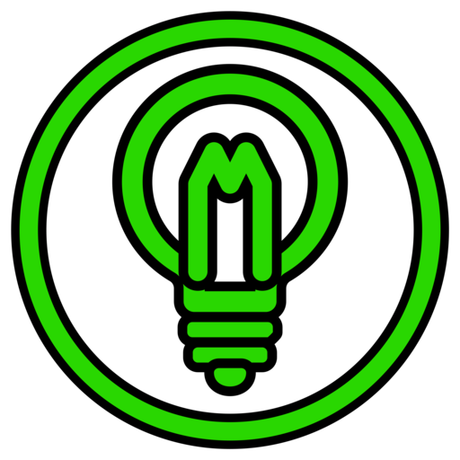
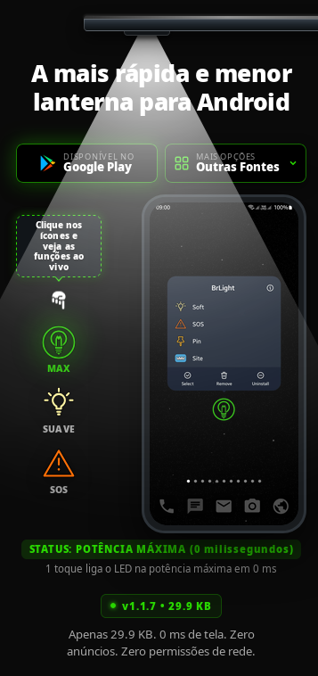
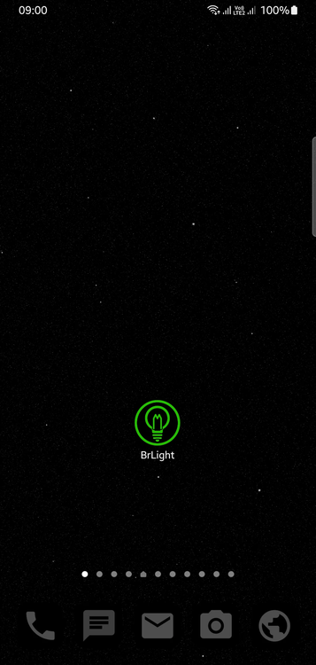
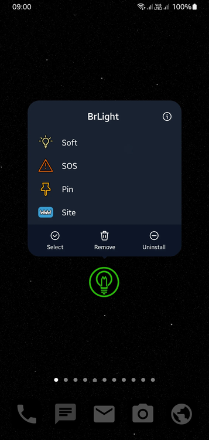
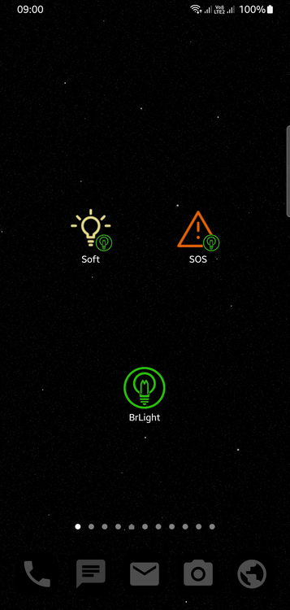

<p align="center">
  
</p>

<h1 align="center">BrLight</h1>

<p align="center">
  <strong>A lanterna mais rápida, leve e direta para Android.</strong><br>
  <em>Clean Software. Built for Humans.</em>
</p>

<p align="center">
  <a href="https://github.com/sys72/BrLight-showcase/releases/latest"></a>
  
  
  
  
  <a href="LICENSE"></a>
</p>

<p align="center">
  <a href="README.md">🇺🇸 English Version</a> •
  <a href="https://app.sys72.com/brlight/">🌐 Demonstração Web Interativa</a> •
  <a href="https://youtube.com/shorts/s54Z85S_J50">🎬 Vídeo Oficial no YouTube</a> •
  <a href="https://github.com/sys72/BrLight-showcase/releases/latest">📦 Baixar APK</a>
</p>

---

## ⚡ O que é o BrLight?

A maioria dos aplicativos de lanterna na Play Store hoje se tornou um pesadelo: downloads de 50 MB, vídeos de propaganda ocupando a tela inteira, rastreadores invasivos e exigência de acesso à sua localização ou fotos apenas para ligar um LED.

**O BrLight destrói completamente essa palhaçada.**

Desenvolvido sob a filosofia oriental **Shokunin** de excelência técnica absoluta, o BrLight é um utilitário de propósito único construído exclusivamente para transformar o LED do seu celular em uma lanterna instantânea e confiável — e nada além disso.

- **1-Clique Seco Instantâneo (0 ms):** Tocou no ícone, a luz acende na hora. Sem telas de abertura, sem interfaces pesadas, zero latência.
- **Tamanho Ridículo (29.9 KB):** O aplicativo inteiro é menor do que uma foto de baixa resolução. Instala em frações de segundo e não ocupa memória.
- **ZERO Anúncios. ZERO Rastreamento. ZERO Telemetria:** Sem AdMob, sem ferramentas de analytics, sem bibliotecas de terceiros. Nem sequer solicita a permissão `android.permission.INTERNET` no Android — é fisicamente incapaz de se comunicar com a rede.
- **SOS Militar Internacional (ITU-R M.1677-1):** Ao contrário de outras lanternas que apenas piscam aleatoriamente, o BrLight emite a cadência oficial de socorro em Código Morse (`··· ——— ···`), reconhecida mundialmente por aeronaves e equipes de busca e salvamento (SAR).
- **Luz Suave / Modo Leitura:** Em celulares com Android 13+ (API 33+), o controle de voltagem de hardware oferece uma iluminação atenuada e confortável que não agride a sua visão noturna.
- **Botão na Cortina (Tile) e Atalhos de Ícone:** Ligue a lanterna direto pela barra de notificações ou segure o dedo no ícone da tela inicial para acessar os modos Luz Máxima, Suave e SOS.

---

## 📸 Capturas de Tela & Vitrine
 
<p align="center">
  
  
  
  
</p>

---

## 📥 Download Oficial & Auditoria Forense

Sempre confira a integridade criptográfica do arquivo baixado:

| Arquivo | Versão | Tamanho | Checksum Forense (SHA-256) |
| :--- | :---: | :---: | :--- |
| **`BrLight-v1.1.7.apk`** | `1.1.7` | `29.9 KB` | `a01adecb96deed31ca5b629990481ef3a10a095c51f2cb32798d3bea09b8c71f` |

👉 **[Baixar a Release Mais Recente (APK)](https://github.com/sys72/BrLight-showcase/releases/latest)**

### Como verificar no Terminal (Linux/macOS):
```bash
sha256sum BrLight-v1.1.7.apk
# A saída deve ser exatamente: a01adecb96deed31ca5b629990481ef3a10a095c51f2cb32798d3bea09b8c71f
```

---

## 🛠️ Requisitos de Sistema & Compatibilidade

- **Android Mínimo:** Android 5.0 (Lollipop / API 21)
- **Android Alvo:** Android 14+ (API 34)
- **Recurso de Luz Suave:** Exige Android 13+ (API 33+) com suporte a multiníveis de hardware (Samsung, Motorola, Pixel, Xiaomi). Em aparelhos anteriores, o app liga na potência máxima padrão com total estabilidade.
- **Arquitetura Suportada:** Agnóstica (código em bytecode puro, compatível com `arm64-v8a`, `armeabi-v7a`, `x86`, `x86_64`).

---

## 🔒 Privacidade & Clean Room Design

O BrLight é mantido pela **Sys72 Labs** sob rigorosa engenharia de **Clean Room Design**:
- **Zero DNA de Terceiros:** Implementação 100% autoral utilizando a arquitetura nativa do `CameraManager.TorchCallback` e `Handler`.
- **Zero Permissões Sensíveis:** Não pede Internet, Memória, Contatos, Localização, Microfone ou Notificações.
- **Declaração de Privacidade:** Leia a política completa e transparente em [https://app.sys72.com/brlight/privacy.html](https://app.sys72.com/brlight/privacy.html).

---

## 💬 Comunidade & Suporte

Encontrou um comportamento inesperado no seu aparelho ou tem sugestões de melhoria?
Abra um chamado oficial na nossa aba de **[GitHub Issues](https://github.com/sys72/BrLight-showcase/issues)**.

---

<p align="center">
  Desenvolvido com obsessão técnica pela <strong>Sys72 Labs</strong>.<br>
  <em>Clean Software. Built for Humans.</em>
</p>
