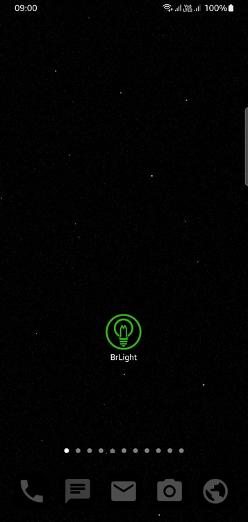
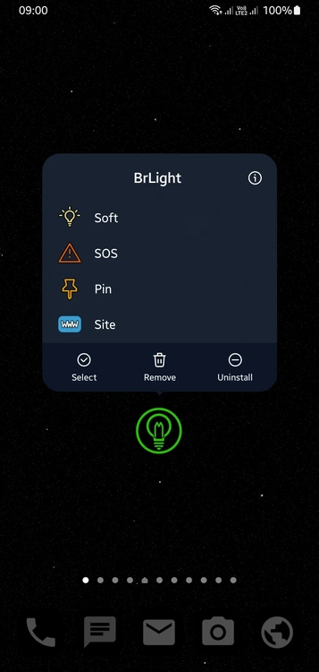
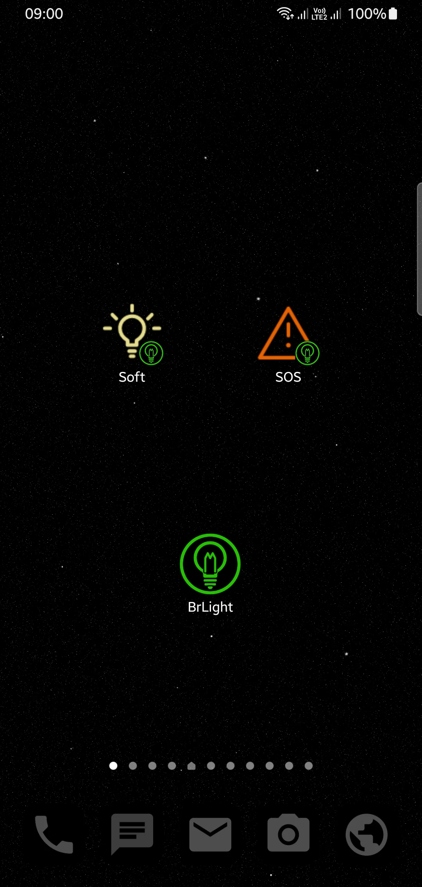

<p align="center">
  
</p>

<h1 align="center">BrLight</h1>

<p align="center">
  <strong>The fastest, purest, and lightest flashlight utility for Android.</strong><br>
  <em>Clean Software. Built for Humans.</em>
</p>

<p align="center">
  <a href="https://github.com/sys72/BrLight-showcase/releases/latest"></a>
  
  
  
  
  <a href="LICENSE"></a>
</p>

<p align="center">
  <a href="README-pt-BR.md">🇧🇷 Versão em Português</a> •
  <a href="https://app.sys72.com/brlight/">🌐 Live Web Demo</a> •
  <a href="https://youtube.com/shorts/s54Z85S_J50">🎬 YouTube Showcase</a> •
  <a href="https://github.com/sys72/BrLight-showcase/releases/latest">📦 Download APK</a>
</p>

---

## ⚡ What is BrLight?

Most flashlight apps on the market today are bloated spyware: 50 MB downloads, full-screen video ads, intrusive tracking SDKs, and demands for location or camera roll access just to toggle an LED.

**BrLight destroys this entire paradigm.**

Engineered under the **Shokunin** philosophy of absolute technical excellence, BrLight is a single-purpose utility built exclusively to turn your smartphone's LED into a reliable, instant flashlight — and nothing else.

- **Instant 1-Tap Toggle (0 ms):** Tap the app icon and the LED turns on immediately. No splash screens, no user interface, zero latency.
- **Microscopic Footprint (29.9 KB):** The entire application is smaller than a single low-resolution photo. It installs in milliseconds and uses virtually zero storage.
- **ZERO Ads. ZERO Tracking. ZERO Telemetry:** No Google AdMob, no analytics, no third-party SDKs. It does not even request the `android.permission.INTERNET` permission — it is physically incapable of connecting to the network.
- **True Military SOS (ITU-R M.1677-1):** Unlike other apps that flash randomly, BrLight emits the international standard Morse code (`··· ——— ···`) recognized globally by search-and-rescue teams (SAR).
- **Soft Light / Reading Mode:** On devices running Android 13+ (API 33+), hardware-level voltage control provides a gentle, low-intensity beam that won't blind your night vision.
- **Quick Settings Tile & Dynamic Shortcuts:** Toggle the torch directly from your Android notification curtain or long-press the home screen icon to access Max, Soft, and SOS modes.

---

## 📸 Screenshots

<p align="center">
  
  
  
</p>

---

## 📥 Official Download & Verification

Always verify the cryptographic integrity of your download:

| Artifact | Version | File Size | SHA-256 Checksum |
| :--- | :---: | :---: | :--- |
| **`BrLight-v1.1.7.apk`** | `1.1.7` | `29.9 KB` | `a01adecb96deed31ca5b629990481ef3a10a095c51f2cb32798d3bea09b8c71f` |

👉 **[Download the Latest Release (APK)](https://github.com/sys72/BrLight-showcase/releases/latest)**

### Verification via Terminal:
```bash
sha256sum BrLight-v1.1.7.apk
# Must output: a01adecb96deed31ca5b629990481ef3a10a095c51f2cb32798d3bea09b8c71f
```

---

## 🛠️ System Requirements & Compatibility

- **Minimum OS:** Android 5.0 (Lollipop / API 21)
- **Target OS:** Android 14+ (API 34)
- **Soft Light Feature:** Requires Android 13+ (API 33+) with hardware multi-level torch support (Samsung, Motorola, Pixel, Xiaomi). On older devices, the app gracefully falls back to standard full brightness.
- **Supported Architectures:** Agnostic (pure bytecode, compatible with `arm64-v8a`, `armeabi-v7a`, `x86`, `x86_64`).

---

## 🔒 Privacy & Clean Room Design

BrLight is developed by **Sys72 Labs** following strict **Clean Room Design** principles:
- **No Third-Party DNA:** 100% original implementation using Android's native `CameraManager.TorchCallback` and `Handler` architecture.
- **Zero Permissions Needed:** Does NOT request Internet, Storage, Contacts, Location, Microphone, or Notifications.
- **Privacy Policy:** Read our full, human-readable privacy declaration at [https://app.sys72.com/brlight/privacy.html](https://app.sys72.com/brlight/privacy.html).

---

## 💬 Community & Bug Tracker

Found an issue on your device or want to suggest an enhancement?
Please open a ticket on our **[GitHub Issues](https://github.com/sys72/BrLight-showcase/issues)** page.

---

<p align="center">
  Developed with obsession by <strong>Sys72 Labs</strong>.<br>
  <em>Clean Software. Built for Humans.</em>
</p>
